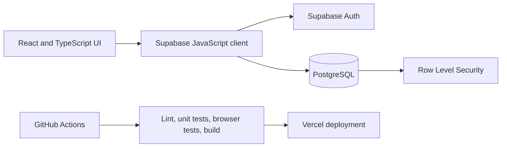
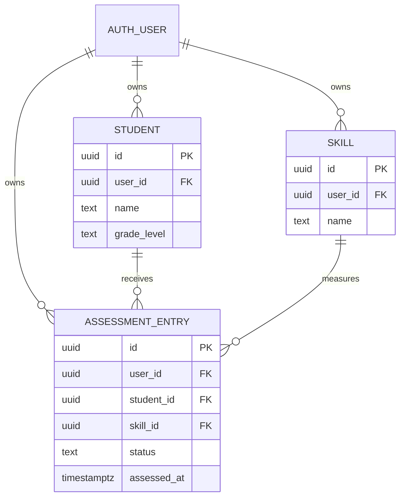

# Architecture

## System overview

The application is a browser client deployed on Vercel. Supabase provides authentication and PostgreSQL access. Authorization is enforced in the database through Row Level Security rather than relying on hidden frontend controls.

## Data model

`assessment_entries` retains dated evidence instead of overwriting one score. The dashboard orders evidence by assessment time and displays the latest status for each student-skill pair.

## Trust boundaries

- The browser and public anon key are untrusted.
- Supabase Auth establishes the current user identity.
- RLS policies require `user_id = auth.uid()` for every protected operation.
- Composite foreign keys bind each assessment's `student_id` and `skill_id` to the same `user_id`, preventing cross-tenant references even if a crafted request bypasses the UI.
- GitHub Actions verifies source quality; it does not verify the configuration of the live Supabase project.

## Delivery path

Changes are developed on focused branches, reviewed in pull requests, and checked by CI. CI runs ESLint, 25 Vitest/Testing Library tests, browser smoke tests in Chromium, and a production build. Vercel deploys merged frontend changes from `main`.
